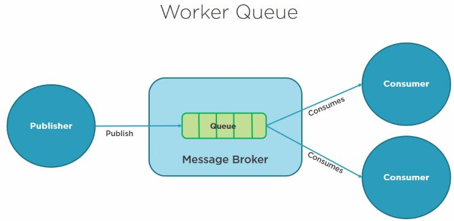
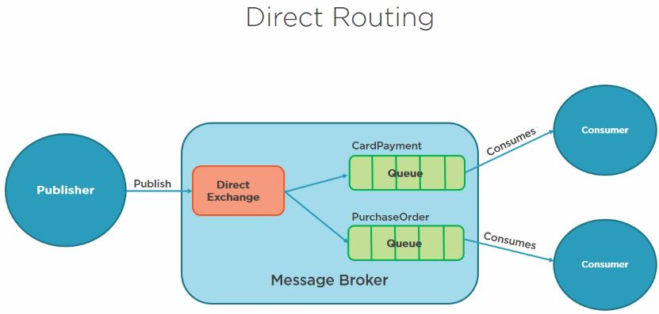

# I) RabbitMQ
Cross-platform system open source messaging system, integrate applications together by using exchanges and queues (Advanced Message Queue or AMQP protocol). RabbitMQ server is written in the Erlang programming language (designed for telecoms industry by Ericsson), Erlang supports distributed full torrent applications, thus ideal to build a messaging system, it has client libraries
that support many different programming environments (. NET, JAVA, Erlang, Ruby, Python,PHP, Perl, C, and C++, Node.js...)
 
The **RabbitMQ** server is a message broker that acts as a message coordinator for the applications that integrate together. i.e. a common platform for sending and receiving messages.

**RabbitMQ features** :
- reliability : message broker built on top of a solid, high-performance, reliable, and durable foundations, this includes Messages can be persisted to disk to guard from loss when a server is restarted,and message delivery acknowledgements from receiver to sender to ensure that the message has been received and stored.


- routing: messages passes through exchanges before they are stored in a queue, There are different exchange - a complex routing scenarios by binding exchanges together


- clustering and high availability: several servers together on a local network, which forms a single, logical message broker. Queues can also be mirrored across multiple servers in a cluster so that in the event of a server failure, we won't lose any messages.

- management web user interface: manage users and their permissions, exchanges, and queues.

- command line interface: offer the same level of administration as the web user interface, we can incorporate RabbitMQ administration into scripts

> paid support plan with a company called Pivotal, who runs and maintains the RabbitMQ open source project


### MSMQ (Microsoft platform since 1997)
Messaging protocol that allows applications running on separate servers and processes to communicate in a fail safe manner. The queue is a temporary storage location which messages can be sent and received reliably when destination is reachable. This enables communication across networks and between computers running Windows only which may not always be connected (versus sockets and other network protocols assure you that direct connections always exist). The Microsoft Distributed Transaction Coordinator(MS DTC)allows multiple operations on multiple queues to be wrapped in a single transaction.

### RabbitMQ vs. MSMQ
- **Centralized vs decentralized** message broker : messages are stored on a central server or cluster of servers, client sends messages to that central server, and then a subscriber can then retrieve that message (VS MSMQ is decentralized : each machine has its own queue)
- **Multi-platform messaging broker** versus **Windows only**: integration with these different platforms
- **Standards** versus **no standards**: AMQP versus own proprietary messaging format

### RabbitMQ management plugin
It provides a browser-based user interface to administer the message broker, as well as a HTTP-based API
for the management and monitoring of your RabbitMQ server: 
- declare, list, and delete exchanges, queues, bindings, users, virtual hosting permissions, 
- monitoring queue length, message rates, and data rates per connection
- sending andreceiving messages
- monitoring the Erlang processes, file descriptors, and memory use, 
- force closing connections and purging queues.


> Go to http://localhost:15672  and then guest/guest
> go to exchange create a TestExchange, go to Queue and create Testqueue
> back to exchange and publish "hello in TestExchange" and back to queue and select Testqueue and then get message.
> if we don't want the messages to be requeued then in Testqueue => Ack Mode: Ack message requeue false { Nack message requeue true, Ack > message requeue false, Reject requeue true,Reject requeue false}


### AMQP Messaging Standard
**RabbitMQ** is built on top of the AMQP protocol; a network protocol that enables client's applications to communicate with the compatible messaging system.

### How's that work?
a message protocol works by receiving messages from a client or publisher and broker routes a message to a receiving application or consumer via an exchange, which acts as a mailbox, it sends a message to a queue by using different rules called bindings (direct routing, fanout, topic, headers) all within the message broker which delivers the message from the queue to a consumer.
The consumer (subscriber to the queue) pulls out the queue when a message is published, a publisher can specify various different messaging attributes which will be used by the message broker.

#### Message acknowledgements
The AMQP protocol has a mechanism for message acknowledgements (ACK) to deal with network unreliability and app failures; when a message is delivered to a consuming application, the consumer notifies the broker, either automatically, or as soon as the app developer decide so. 
When message ACK are used, the message broker will only remove the message from the queue when it receives a notification for that message. If a user messages are routed by the routing key (acts like a filter), it cannot be routed anywhere, it can either be returned to the sender, dropped, or if configured, be placed on a dead letter queue which is monitored.

**Exchanges** :
- They are AMQP entities where messages are sent to the message broker. 

- They take a message and then route it to one or more queues. 

- The type of routing depends on the exchange type used in different exchange rules (bindings).

**Types of exchanges**:

- **Direct exchanges**: queue binds to the exchange using a routing key, ideal for publishing a message onto just one queue  (message and queue keys must match)

 e.g. used to distribute messages between multiple work processes in a round robin manner

- **Fanout exchanges**: routes messages to all queues that are bound to it (routing key is ignored = broadcast), ideal for the broadcast

 e.g sync online game scores, weather updates, chat sessions between groups of people

- **Topic exchanges**: one or many queues based on pattern matches between the message routing key

e.g. multi-card/wild carded routing key  of messages to different queues. If * hash are used in binding then topic exchanges = fanout exchanges, if not used then topic exchanges = direct exchanges  

- **Header exchanges**: routing of multiple attributes that are expressed in headers (i.e. routing key/queue is ignored = only express one piece of information)

**Header exchanges** looks like a supercharged direct exchanges, as the routing is based on header values (also used as direct exchanges when routing key is not string)

Each exchange is declared with a set of attributes :
- **name**: name of the exchange, 
- **durability** flag: whether or not the messages sent to the exchange survive a broken server or restart by persisting the messages to disk.
- **auto-delete** flag: if the exchange is deleted when all the other queues are finished using it
- **arguments**: arguments that message broker dependent on.

> The AMQP message brokers contain a default exchange (pre-declared) that is a direct exchange with no name (empty string); useful for simple app where the queue that is created it is bound to it with a routing key, which is the same as the queue name. 
> e.g declaring a queue with the name 'payment requests', the message broker will bind it to the default exchange by using the 'payment request' as the routing key. i.e. the default exchange makes it looks as it directly delivers messages to queues (not technically happening). 


**Queues, Bindings, and Consumers**
**first-in first-out** basis, it must be declared. If the queue doesn't already exist, it will be created. If the queue already exists, then re-declaring the queue will have no additional effect on the queue that already exists

**Queues have additional properties over exchanges**

- **Name** : name of the queue (255 char max), can be picked by the app, or it can be automatically named by the broker that generates it. 

- **Durable**, whether the queue and messages will survive a broker or a server re-start,queue is persisted to disk. This makes only the queue persistent, and not the messages, durability means the queue will be re-declared once the broker is re-started. If we want the messages to be also persisted, then we have to post persistent messages. Making queues durable does come with additional overhead => decide if the app can't lose messages or not.

- **Exclusive**: is used by only one connection, and the queue will be deleted when that connection closes.

- **Auto Delete**: is deleted when a consumer or subscriber unsubscribes. 

**bindings** are defined when we need to define rules that specify how messages are routed from exchanges to queues, they may have an optional routing key attribute that is used by some exchange types to route messages from the exchange to the queue.


If an **AMQP message** cannot be routed to any queue (e.g. missing valid binding from the exchange to that queue) then it either dropped, or returned to the publisher, depending on the message attributes the publisher has set.


**From systems that consume messages perspective**, storing messages in queues is good, provided that there are apps on the other side of the queues to consume those messages.

**Consumers/subscribers with a set of queues**
Let assume an apps will register as **consumers/subscribers** to a **set of queues**, a common  scenario will be to balance a load of apps feeding from the queues in a high volume scenario. When a consuming application acts on a message from the queue, it is possible that a problem could occur and lead into a message lose, futher, when an app acts on a message, that message is removed from the queue, but we need to make sure that the message has been successfully processed before that to happen. 


The **AMQP protocol** gives a set of options to **remedy** that situations (i.e. when a message is removed from the queue):
- The **message is removed** once a **broker** has sent the **message** to the **application**.
- Or, the **message is removed** once the **application** is sent an **acknowledgement message** back to the **broker**.


With an **explicit acknowledgement**, it is up to the **app** to decide when to **remove the message** from that **queue** (received a message, or finished processing it. 


If the consuming **app crashes before** the **acknowledgement** has been sent, then a **message broker** will try to **redeliver** the message to another consumer. When an app **processes a message**, that processing may or may not succeed. If the processing fails for any reason(e.g. database time outs), then a consumer app can reject the message. The app then can ask the broker to discard the message or re-queue it. 

> If there's only one consumer app subscribed to the queue, we need to **make sure** that we **don't create an infinite message delivery loop** by rejecting and re-queuing the message from the same consumer.

### RabbitMQ Client Library
We need to install the RabbitMQ client library for dot net. to develop software against RabbitMQ. [API guide to client library API](https://www.rabbitmq.com/devtools.html)

```sh
Install Package RabbitMQ.Client
```

RabbitMQ client library is an implementation of the **AMQP client library for C#**. The client library implements the **AMQP specifications**. The API is closely modeled on the **AMQP protocol specification**, with little additional abstraction. 

The core API interface and classes are defined in the **RabbitMQ.Client namespace**. The main **API interface** and classes are:

- **IModel**: represents AMQP data channel, and provides most of the AMQP operations. 

- **IConnection**: AMQP connection to the message broker

- **ConnectionFactory** : constructs *IConnection* instances. 

*Other useful classes include*: 

- **ConnectionParameters**: used to configure the connection factory

- **QueuingBasicConsumer**: receives messages delivered from the server.

```sh
//Connecting to a message Broker
ConnectionFactory factory = new ConnectionFactory { HostName = "localhost", UserName = "guest", Password = "guest" };
IConnection connection = factory.CreateConnection;
IModel channel = connection.CreateModel;
```

```sh
//Exchanges and queues are Idempotent
//Idempotent operation : if the exchange/Queue is already there it won't be created, otherwise it will get created.
var ExchangeName = channel.ExchangeDeclare ("MyExchange", "direct");
channel.QueueDeclare("MyQueue");
channel.QueueBind("MyQueue", ExchangeName ,"");
```

### Example of a Standard Queue 
using client API we have one producer posting the payment message onto a "StandardQueue" queue, and one consumer reading that message from the "StandardQueue" queue. It looks like the producer posts directly onto the "StandardQueue" queue, instead of using an exchange. 


What happens is under the covers we are posting to the **default exchange**; **RabbitMQ broker** will bind "StandardQueue" queue to the default exchange using "StandardQueue" (name of the queue) as the rooting key. Therefore a message publishes to the default exchange with the routing key "StandardQueue" will be routing to "StandardQueue" queue.

**Declaring** the **queue** in **RabbitMQ** is an **idempotent operation**, i.e. it will only be created if it doesn't already exist. 
> Generally speaking, an item hosting operation is one that has no additional effect if it is called more than once, with the same input parameters. 


```sh
string QueueName = "StandardQueue";

_factory = new ConnectionFactory { HostName = "localhost", UserName = "guest", Password = "guest"};
_connection = _factory.CreateConnection();
_channel = _connection.CreateModel(); 

//tells the broker the queue is durable. i.e. that queue is persisted to disk and will survive,
//or be re-created when the server is restarted.
//Exchanges and queues are Idempotent
//Idempotent operation : if the exchange/Queue is already there it won't be created, otherwise it will get created.                     
 _channel.QueueDeclare(queue:QueueName, durable:true, exclusive:false, autoDelete:false, arguments:null);         

```

```sh
//Send message  
//payment.Serialize(): converts payment message instances into a compressed bytes[] to a json representation            
 channel.BasicPublish(exchange: "", routingKey: QueueName, basicProperties: null, body: payment.Serialize());
```

```sh
//receive message              
 _channel.BasicConsume(queue: QueueName, noAck: true, consumer);

//DeSerialize is user-defined extension method 
 var message = (Payment)consumer.Queue.Dequeue().Body.DeSerialize(typeof(Payment));
```
> Consumers last so long as the channel they were declared on, or until the client cancels them.

[more ...](src/RabbitMq/StandardQueue/Program.cs)


### Example of a Multiple Queues (i.e Worker Queue or multiple consumers) 
The idea is that messages from the queue are shared between one or more consumers, it commonly used when you want to share the load, between consumers when processing higher volumes of messages.


**Producer**
```sh
string QueueName = "WorkerQueue_Queue";

_factory = new ConnectionFactory { HostName = "localhost", UserName = "guest", Password = "guest"};
_connection = _factory.CreateConnection();
_channel = _connection.CreateModel(); 

//tells the broker the queue is durable. i.e. that queue is persisted to disk and will survive,
//or be re-created when the server is restarted.                     
 _channel.QueueDeclare(queue:QueueName, durable:true, exclusive:false, autoDelete:false, arguments:null);        

```

```sh
//Send message  
//payment.Serialize(): converts payment message instances into a compressed bytes[] to a json representation            
 channel.BasicPublish(exchange: "", routingKey: QueueName, basicProperties: null, body: payment.Serialize());
```
[more on producer ...](src/RabbitMq/WorkerQueue_Producer/Program.cs)

**Consumer**
 
```sh
//(Spec method) Configures Quality Of Service parameters of the Basic content-class.
channel.BasicQos(prefetchSize: 0, prefetchCount: 1, global: false);

var consumer = new QueueingBasicConsumer(channel);
//we want to expect an acknowledgement message (noAck: false)
channel.BasicConsume(queue: QueueName, noAck: false, consumer: consumer);

```

```sh
while (true)
{
	var ea = consumer.Queue.Dequeue();
	
	//once we have the message, and have acted on it, we will send a delivery acknowledgement next
	var message = (Payment)ea.Body.DeSerialize(typeof(Payment));
		
    //This tells the message broker that we are finished processing the message,
    //and we are ready to start processing the next message when it is ready.
	//the next message will not be received by this consumer, until it sends this delivery acknowledgement. 
	//acknowledgement sent to the RabbitMQ server, meaning we've finished with that message, and it can discard it from the queue
	channel.BasicAck(deliveryTag: ea.DeliveryTag, multiple: false);
}

```
> prefetchCount: 1 (load balancing among workers) means that RabbitMQ won't dispatch a new message to a consumer, until that consumer is finished processing and acknowledged the message, if a worker is busy (noAck) RabbitMQ will dispatch a message on the next worker that is not busy.


[more on consumer ...](src/RabbitMq/WorkerQueue_Consumer/Program.cs)


### Publish and Subscribe queues
The messages are sent from the exchange to all consumers that are **bound to the exchange**. i.e. the messages are not picked up by multiple consumers to distribute load, but instead all subscribed consumers with interest in receiving the messages. Unlike the previous example where we defined the **queue directly** which's use a **default exchange** (with routingKey = queue_name) behind the scenes, here we will set up an explicit **Fanout** exchange. A **fanout exchange** routes messages to all of the queues that are bound to it(i.e. routing key is ignored). 


**[Publisher](src/RabbitMq/PublishSubscribe_Publisher/Program.cs)**
> If queues are bound to a fanout exchange, when a message is published onto that exchange a copy of that message is delivered to all those queues.

```sh
string ExchangeName = "PublishSubscribe_Exchange";
_factory = new ConnectionFactory { HostName = "localhost", UserName = "guest", Password = "guest" };
_connection = _factory.CreateConnection();
_channel = _connection.CreateModel();

//Idempotent operation : if the exchange/Queue is already there it won't be created, otherwise it will get created.
_channel.ExchangeDeclare(exchange: ExchangeName, type: "fanout", durable: false);

//We are publishing directly to an and exchange any queues that have been bound to that exchange will receive the message
//No need for routingKey Vs Default exchange (which bears the name of the queue!) 
_channel.BasicPublish(exchange: ExchangeName, routingKey: "", basicProperties: null, body: message.Serialize());
```
**[Subscriber](src/RabbitMq/PublishSubscribe_Subscriber/Program.cs)**
```sh
string ExchangeName = "PublishSubscribe_Exchange";
_factory = new ConnectionFactory { HostName = "localhost", UserName = "guest", Password = "guest" };
using (_connection = _factory.CreateConnection())
{
    using (var channel = _connection.CreateModel())
  {
	//Idempotent operation : if the exchange/Queue is already there it won't be created, otherwise it will get created.
	channel.ExchangeDeclare(exchange: ExchangeName, type: "fanout");

	//this uses a system generated queue name such as amq.gen-qVC1KT9w-plxzpV9MVId9w
    var queueName = channel.QueueDeclare().QueueName;
	
    channel.QueueBind(queue: queueName, exchange: ExchangeName, routingKey: "");
	
    _consumer = new QueueingBasicConsumer(channel);
	
	//consumer has created its own queue, and subscribed itself to the exchange
	//It will receive all messages that are sent to the exchange ("PublishSubscribe_Exchange")
	//noAck: true =>  No waiting for a message acknowledgement before receiving the next message.
	//We don't need to as our subscriber application is reading from its own queue 
	//it takes msg as it can deal with, no work split no load balancing each subscriber will receive the same msg copies
     channel.BasicConsume(queue: queueName, noAck: true, consumer: _consumer);
    
	while (true)
    {
        var ea = _consumer.Queue.Dequeue();
        var message = (Payment)ea.Body.DeSerialize(typeof(Payment));
		
		//no need to send message acknowledgement to tell RabbitMQ that we're finished with a message, 
		//because we want all messages to be sent to every consumer, otherwise get removed from the queue
		//channel.BasicAck(deliveryTag: ea.DeliveryTag, multiple: false);
    }
  }
}
```

### Direct routing
The **routing key** will be used, so direct messages to a specific consumer (Vs **fanout exchange** where routing key would be ignored). 
In this example, the producer app will post two different types of messages, **card payment** and **purchase order** messages posted to the exchange, each using specific **routing key**. We create two different **consuming apps** one looking out for **card payments**, and the other is only interested in **purchase orders**. They pick up their messages based on that **routing key**.



**[Publisher](src/RabbitMq/DirectRouting_Publisher/Program.cs)**
```sh
string ExchangeName = "DirectRouting_Exchange";
string CardPaymentQueueName = "CardPaymentDirectRouting_Queue";
string PurchaseOrderQueueName = "PurchaseOrderDirectRouting_Queue";

_factory = new ConnectionFactory { HostName = "localhost", UserName = "guest", Password = "guest" };
_connection = _factory.CreateConnection();
_channel = _connection.CreateModel();

 //type: direct exchange
 //Queues an exchanges are idempotent
_channel.ExchangeDeclare(exchange: ExchangeName, type: "direct");

//durable: true=> queues are persisted to disk, if the server ever crashes or resets,
//the queue will be persisted and come back to life.
_channel.QueueDeclare(CardPaymentQueueName, durable: true, exclusive: false, autoDelete: false, arguments: null);
_channel.QueueDeclare(PurchaseOrderQueueName, durable: true, exclusive: false, autoDelete: false, arguments: null);

//Binding: exchange name, the queue name and the routing key
//routingKey: determines what queue the message is routed to.
_channel.QueueBind(queue: CardPaymentQueueName, exchange: ExchangeName, routingKey: "CardPayment");
_channel.QueueBind(queue: PurchaseOrderQueueName, exchange: ExchangeName, routingKey: "PurchaseOrder");

_channel.BasicPublish(exchange: ExchangeName, routingKey: routingKey, basicProperties: null, body: message);

```

**[CardPayment Subscriber](src/RabbitMq/DirectRouting_Subscriber1/Program.cs)**

```sh
string ExchangeName = "DirectRouting_Exchange";
string CardPaymentQueueName = "CardPaymentDirectRouting_Queue";

_factory = new ConnectionFactory { HostName = "localhost", UserName = "guest", Password = "guest" };
using (_connection = _factory.CreateConnection())
{
    using (var channel = _connection.CreateModel())
    {
        //Queue binding to exchange and listen to CardPayment messages
		//Queues an exchanges are idempotent
		channel.ExchangeDeclare(exchange: ExchangeName, type: "direct");
        channel.QueueDeclare(queue: CardPaymentQueueName, durable: true, exclusive: false, autoDelete: false, arguments: null);
        channel.QueueBind(queue: CardPaymentQueueName, exchange: ExchangeName, routingKey: "CardPayment");
		
		//tells RabbitMQ to give one message at time per worker,
		//i.e.  don't dispatch any message to a worker until it has processed and acknowledged the previous one.
		//otherwise it will dispatch it to the next worker that is not busy
        channel.BasicQos(prefetchSize: 0, prefetchCount: 1, global: false);
		
		
		//queuing basic consumer is created 
        var consumer = new QueueingBasicConsumer(channel);
		
		//and basic consumer is called to start reading from the queue
		//noAck: false => we care that the messages are safe on the queue and we want the message to be acknowledged
		//in case of the consumer crashes, the message is put back into the queue and eventually later
		//dispatched to the next iddle worker.
		//in case of the consumer succeedes Ack is sent back to the broker, message (successfully processed) is discarded 
		//from the queue and worker is ready to process another one.
        channel.BasicConsume(queue: CardPaymentQueueName, noAck: false, consumer: consumer);

        while (true)
        {
			var ea = consumer.Queue.Dequeue();
			var message = (Payment)ea.Body.DeSerialize(typeof(Payment));
			var routingKey = ea.RoutingKey;
			
			channel.BasicAck(deliveryTag: ea.DeliveryTag, multiple: false);
        }
    }
}


```


**[PurchaseOrder Subscriber](src/RabbitMq/DirectRouting_Subscriber2/Program.cs)**

```sh
string ExchangeName = "DirectRouting_Exchange";
string PurchaseOrderQueueName = "PurchaseOrderDirectRouting_Queue";
_factory = new ConnectionFactory { HostName = "localhost", UserName = "guest", Password = "guest" };
using (_connection = _factory.CreateConnection())
{
   //Queue binding to exchange and listen to PurchaseOrder messages
   //Queues an exchanges are idempotent
   channel.ExchangeDeclare(exchange: ExchangeName, type: "direct");
   channel.QueueDeclare(queue: PurchaseOrderQueueName, durable: true, exclusive: false, autoDelete: false, arguments: null);
   channel.QueueBind(queue: PurchaseOrderQueueName, exchange: ExchangeName, routingKey: "PurchaseOrder");

   //tells RabbitMQ to give one message at time per worker,
   //i.e.  don't dispatch any message to a worker until it has processed and acknowledged the previous one.
   //otherwise it will dispatch it to the next worker that is not busy
   channel.BasicQos(prefetchSize: 0, prefetchCount: 1, global: false);


   //queuing basic consumer is created 
   var consumer = new QueueingBasicConsumer(channel);

   //and basic consumer is called to start reading from the queue
   //noAck: false => we care that the messages are safe on the queue and we want the message to be acknowledged
   //in case of the consumer crashes, the message is put back into the queue and eventually later
   //dispatched to the next idle worker.
   //in case of the consumer succeeded, a Ack is sent back to the broker, message (successfully processed) is discarded 
   //from the queue and worker is ready to process another one.
   channel.BasicConsume(queue: PurchaseOrderQueueName, noAck: false, consumer: consumer);

   while (true)
   {
       var ea = consumer.Queue.Dequeue();
       var message = (PurchaseOrder)ea.Body.DeSerialize(typeof(PurchaseOrder));
       var routingKey = ea.RoutingKey;

       // a Ack is sent back to the broker, message (successfully processed) is discarded 
       //from the queue and worker is ready to process another one.
       channel.BasicAck(deliveryTag: ea.DeliveryTag, multiple: false);
        }
}
```

### Message queueeing

- They are components used for inter-process communication or for interthread communication within the same process. They use a queue for messaging, which is passing data between systems. 

- They provides an asynchronous communications protocol. The sender and the receiver of the message do not need to interact with the message queue at the same time. Messages placed onto the queue are stored until the recipient retrieves them.

Next, a few considerations that can have substantial effects on transactional semantics, system reliability, and system efficiency. 

- durability : messages may be kept in memory, written to disk, or even committed to a database if the need for reliability indicates a more resource-intensive solution. 

- Security policies: we define which application should have access to thesemessages. 

- Message purging policies where queues or messages may have a time-to-live, which defines when they will be automatically deleted. 

- Message filtering where some systems support filtering data so a subscriber may only see messages matching some pre-specified criteria of interest. 
- Delivery policies where we define the need to guarantee that a message is delivered at least once or no more than once. 

- Routing policies where in a system with many queue servers, what server should receive a message or a queue's messages. 

- Batching policies, this is where you define if messages should be deliveredimmediately or should the system wait a bit and then try to deliver many messages at once. 

- Queueing criteria, determines when should a message be considered unqueued, when one queue has it or when it's been forwarded to at least one remote queue or to all queues 
- notification, when a publisher may need to know when some or all of the subscribers have received a message. 


# II) Events-sourcing
