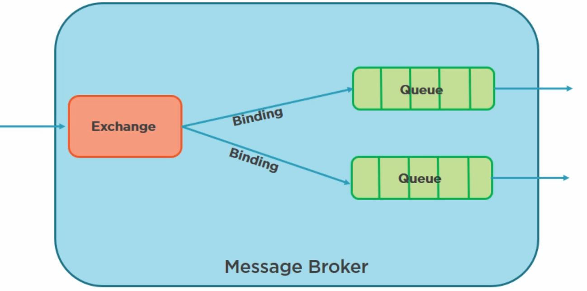
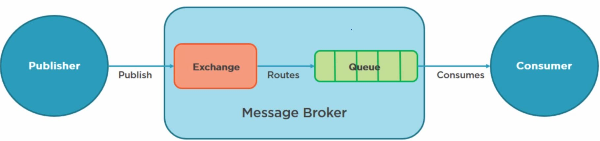
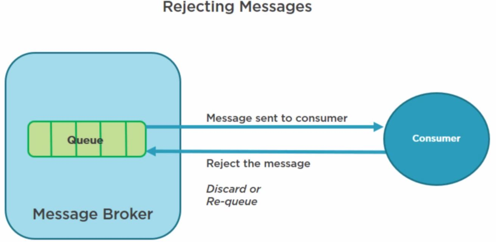

# I) RabbitMQ
Cross-platform system open source messaging system, integrate applications together by using exchanges and queues (Advanced Message Queue or AMQP protocol). RabbitMQ server is written in the Erlang programming language (designed for telecoms industry by Ericsson), Erlang supports distributed full torrent applications, thus ideal to build a messaging system, it has client libraries
that support many different programming environments (. NET, JAVA, Erlang, Ruby, Python,PHP, Perl, C, and C++, Node.js...)
 
The **RabbitMQ** server is a message broker that acts as a message coordinator for the applications that integrate together. i.e. a common platform for sending and receiving messages.

**RabbitMQ features** :
- reliability : message broker built on top of a solid, high-performance, reliable, and durable foundations, this includes Messages can be persisted to disk to guard from loss when a server is restarted,and message delivery acknowledgements from receiver to sender to ensure that the message has been received and stored.


- routing: messages passes through exchanges before they are stored in a queue, There are different exchange - a complex routing scenarios by binding exchanges together


- clustering and high availability: several servers together on a local network, which forms a single, logical message broker. Queues can also be mirrored across multiple servers in a cluster so that in the event of a server failure, we won't lose any messages.

- management web user interface: manage users and their permissions, exchanges, and queues.

- command line interface: offer the same level of administration as the web user interface, we can incorporate RabbitMQ administration into scripts

> paid support plan with a company called Pivotal, who runs and maintains the RabbitMQ open source project


### MSMQ (Microsoft platform since 1997)
Messaging protocol that allows applications running on separate servers and processes to communicate in a fail safe manner. The queue is a temporary storage location which messages can be sent and received reliably when destination is reachable. This enables communication across networks and between computers running Windows only which may not always be connected (versus sockets and other network protocols assure you that direct connections always exist). The Microsoft Distributed Transaction Coordinator(MS DTC)allows multiple operations on multiple queues to be wrapped in a single transaction.

### RabbitMQ vs. MSMQ
- **Centralized vs decentralized** message broker : messages are stored on a central server or cluster of servers, client sends messages to that central server, and then a subscriber can then retrieve that message (VS MSMQ is decentralized : each machine has its own queue)
- **Multi-platform messaging broker** versus **Windows only**: integration with these different platforms
- **Standards** versus **no standards**: AMQP versus own proprietary messaging format

### RabbitMQ management plugin
It provides a browser-based user interface to administer the message broker, as well as a HTTP-based API
for the management and monitoring of your RabbitMQ server: 
- declare, list, and delete exchanges, queues, bindings, users, virtual hosting permissions, 
- monitoring queue length, message rates, and data rates per connection
- sending andreceiving messages
- monitoring the Erlang processes, file descriptors, and memory use, 
- force closing connections and purging queues.


>> Go to http://localhost:15672  and then guest/guest
>> go to exchange create a TestExchange, go to Queue and create Testqueue
>> back to exchange and publish "hello in TestExchange" and back to queue and select Testqueue and then get message.
>> if we don't want the messages to be requeued then in Testqueue => Ack Mode: Ack message requeue false { Nack message requeue true, Ack >> message requeue false, Reject requeue true,Reject requeue false}


### AMQP Messaging Standard
**RabbitMQ** is built on top of the AMQP protocol; a network protocol that enables client's applications to communicate with the compatible messaging system.

### How's that work?
a message protocol works by receiving messages from a client or publisher and broker routes a message to a receiving application or consumer via an exchange, which acts as a mailbox, it sends a message to a queue by using different rules called bindings (direct routing, fanout, topic, headers) all within the message broker which delivers the message from the queue to a consumer.
The consumer (subscriber to the queue) pulls out the queue when a message is published, a publisher can specify various different messaging attributes which will be used by the message broker.

#### Message acknowledgements
The AMQP protocol has a mechanism for message acknowledgements (ACK) to deal with network unreliability and app failures; when a message is delivered to a consuming application, the consumer notifies the broker, either automatically, or as soon as the app developer decide so. 
When message ACK are used, the message broker will only remove the message from the queue when it receives a notification for that message. If a user messages are routed by the routing key (acts like a filter), it cannot be routed anywhere, it can either be returned to the sender, dropped, or if configured, be placed on a dead letter queue which is monitored.

**Exchanges** :
- They are AMQP entities where messages are sent to the message broker. 

- They take a message and then route it to one or more queues. 

- The type of routing depends on the exchange type used in different exchange rules (bindings).

**Types of exchanges**:

- **Direct exchanges**: queue binds to the exchange using a routing key, ideal for publishing a message onto just one queue  (message and queue keys must match)

 e.g. used to distribute messages between multiple work processes in a round robin manner

- **Fanout exchanges**: routes messages to all queues that are bound to it (routing key is ignored = broadcast), ideal for the broadcast

 e.g sync online game scores, weather updates, chat sessions between groups of people

- **Topic exchanges**: one or many queues based on pattern matches between the message routing key

e.g. multi-card/wild carded routing key  of messages to different queues. If * hash are used in binding then topic exchanges = fanout exchanges, if not used then topic exchanges = direct exchanges  

- **Header exchanges**: routing of multiple attributes that are expressed in headers (i.e. routing key/queue is ignored = only express one piece of information)

**Header exchanges** looks like a supercharged direct exchanges, as the routing is based on header values (also used as direct exchanges when routing key is not string)

Each exchange is declared with a set of attributes :
- **name**: name of the exchange, 
- **durability** flag: whether or not the messages sent to the exchange survive a broken server or restart by persisting the messages to disk.
- **auto-delete** flag: if the exchange is deleted when all the other queues are finished using it
- **arguments**: arguments that message broker dependent on.

>> The AMQP message brokers contain a default exchange (pre-declared) that is a direct exchange with no name (empty string); useful for simple app where the queue that is created it is bound to it with a routing key, which is the same as the queue name. 
>> e.g declaring a queue with the name 'payment requests', the message broker will bind it to the default exchange by using the 'payment request' as the routing key. i.e. the default exchange makes it looks as it directly delivers messages to queues (not technically happening). 


**Queues, Bindings, and Consumers**
**first-in first-out** basis, it must be declared. If the queue doesn't already exist, it will be created. If the queue already exists, then re-declaring the queue will have no additional effect on the queue that already exists

**Queues have additional properties over exchanges**

- **Name** : name of the queue (255 char max), can be picked by the app, or it can be automatically named by the broker that generates it. 

- **Durable**, whether the queue and messages will survive a broker or a server re-start,queue is persisted to disc. This makes only the queue persistent, and not the messages, durability means the queue will be re-declared once the broker is re-started. If we want the messages to be also persisted, then we have to post persistent messages. Making queues durable does come with additional overhead => decide if the app can't lose messages or not.

- **Exclusive**: is used by only one connection, and the queue will be deleted when that connection closes.

- **Auto Delete**: is deleted when a consumer or subscriber unsubscribes. 

**bindings** are defined when we need to define rules that specify how messages are routed from exchanges to queues, they may have an optional routing key attribute that is used by some exchange types to route messages from the exchange to the queue.



If an **AMQP message** cannot be routed to any queue (e.g. missing valid binding from the exchange to that queue) then it either dropped, or returned to the publisher, depending on the message attributes the publisher has set.


**From systems that consume messages perspective**, storing messages in queues is good, provided that there are apps on the other side of the queues to consume those messages.

**Consumers/subscribers with a set of queues**
Let assume an apps will register as **consumers/subscribers** to a **set of queues**, a common  scenario will be to balance a load of apps feeding from the queues in a high volume scenario. When a consuming application acts on a message from the queue, it is possible that a problem could occur and lead into a message lose, futher, when an app acts on a message, that message is removed from the queue, but we need to make sure that the message has been successfully processed before that to happen. 




The **AMQP protocol** gives a set of options to **remedy** that situations (i.e. when a message is removed from the queue):
- The **message is removed** once a **broker** has sent the **message** to the **application**.
- Or, the **message is removed** once the **application** is sent an **acknowledgement message** back to the **broker**.


With an **explicit acknowledgement**, it is up to the **app** to decide when to **remove the message** from that **queue** (received a message, or finished processing it. 



If the consuming **app crashes before** the **acknowledgement** has been sent, then a **message broker** will try to **redeliver** the message to another consumer. When an app **processes a message**, that processing may or may not succeed. If the processing fails for any reason(e.g. database time outs), then a consumer app can reject the message. The app then can ask the broker to discard the message or re-queue it. 

>> If there's only one consumer app subscribed to the queue, we need to **make sure** that we **don't create an infinite message delivery loop** by rejecting and re-queuing the message from the same consumer.

### RabbitMQ Client Library
We need to install the RabbitMQ client library for dot net. to develop software against RabbitMQ. [API guide to client library API](https://www.rabbitmq.com/devtools.html)

```sh
Install Package RabbitMQ.Client
```

RabbitMQ client library is an implementation of the **AMQP client library for C#**. The client library implements the **AMQP specifications**. The API is closely modeled on the **AMQP protocol specification**, with little additional abstraction. 

The core API interface and classes are defined in the **RabbitMQ.Client namespace**. The main **API interface** and classes are:

- **IModel**: represents AMQP data channel, and provides most of the AMQP operations. 

- **IConnection**: AMQP connection to the message broker

- **ConnectionFactory** : constructs *IConnection* instances. 

*Other useful classes include*: 

- **ConnectionParameters**: used to configure the connection factory

- **QueuingBasicConsumer**: receives messages delivered from the server.

```sh
#Connecting to a message Broker
ConnectionFactory factory = new ConnectionFactory { HostName = "localhost", UserName = "guest", Password = "guest" };
IConnection connection = factory.CreateConnection;
IModel channel = connection.CreateModel;
```

```sh
#Exchanges and queues
var ExchangeName = channel.ExchangeDeclare ("MyExchange", "direct");
channel.QueueDeclare("MyQueue");
channel.QueueBind("MyQueue", ExchangeName ,"");
```


# II) Events-sourcing
